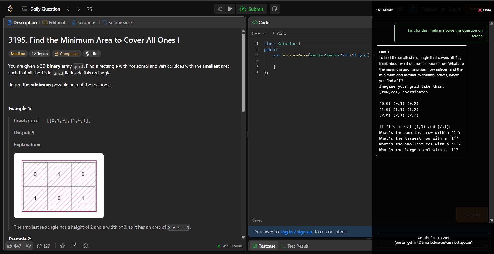

# 🚀 LeeAIEx – AI Tutor for LeetCode

LeeAIEx is a **Chrome extension** that enhances your LeetCode experience by injecting a **smart AI tutor** directly into the platform.
It adds a **floating button** and a **sidebar** where you can ask for hints, explanations, and step-by-step solutions powered by **Google Gemini API**.

---

## ✨ Features

* 🧑‍🏫 **AI Tutor** – Get hints, explanations, and solution breakdowns for LeetCode problems.
* ⚡ **Seamless Integration** – Injected button + sidebar inside the LeetCode UI.
* 🖥️ **Modern Tech Stack** – Built with **React (frontend)**, **Node.js + Express (backend)**.
* 🔑 **Gemini API Support** – Uses Google’s Gemini AI for natural, high-quality answers.
* 🛠️ **Customizable** – Easy to extend with new AI prompts or UI improvements.

---

## 🏗️ Project Structure

```
leeaiex/
│── public/        #  Chrome extension UI (button + sidebar) + manifest.json
│── backend/         # Node.js + Express server (handles Gemini API calls)
│── public/          # Assets (icons, static files)
```

**Flow:**

1. User clicks the injected **AI Tutor button** on LeetCode.
2. Sidebar opens → user enters query (hint, explanation, etc.).
3. Frontend → Backend (Express) → Gemini API → Response returned to sidebar.

---

## 🔧 Installation & Setup

### 1️⃣ Clone the Repository

```bash
git clone https://github.com/AtulYadavCodes/leeaiex.git
cd leeaiex
```

### 2️⃣ Backend Setup

```bash
cd backend
npm install
```

Create a `.env` file:

```env
PORT=5000
GEMINI_API_KEY=your_gemini_api_key
```

### 3️⃣ Frontend Setup

```bash
cd ../frontend
npm install
npm run build
```

This will generate a `dist/` folder for the Chrome extension.

### 4️⃣ Load Extension in Chrome

1. Open Chrome and go to `chrome://extensions/`
2. Enable **Developer Mode**
3. Click **Load unpacked**
4. Select the `frontend/dist` folder

---

## 🧪 Usage

* Open [LeetCode](https://leetcode.com/problems)
* Click the **LeeAIEx floating button**
* The **AI Tutor sidebar** will appear
* Ask for **hints, explanations, or step-by-step solutions**

---

## 📸 Screenshots





## 🤝 Contributing

Contributions are welcome!

1. Fork the repo
2. Create a feature branch
3. Submit a pull request 🚀

---

## 📜 License

MIT License © 2025 [Atul Yadav](https://github.com/AtulYadavCodes)
