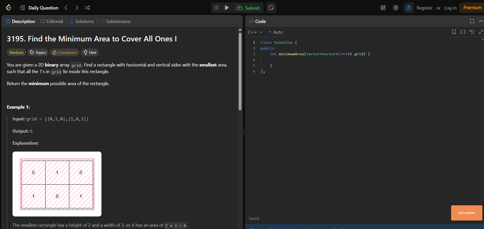
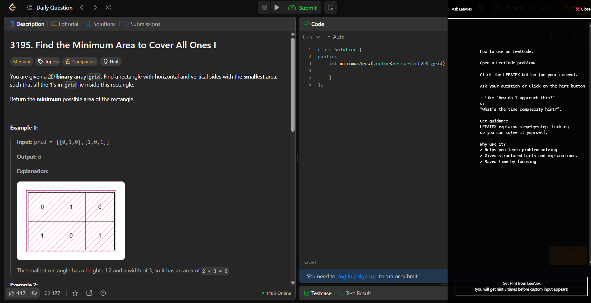
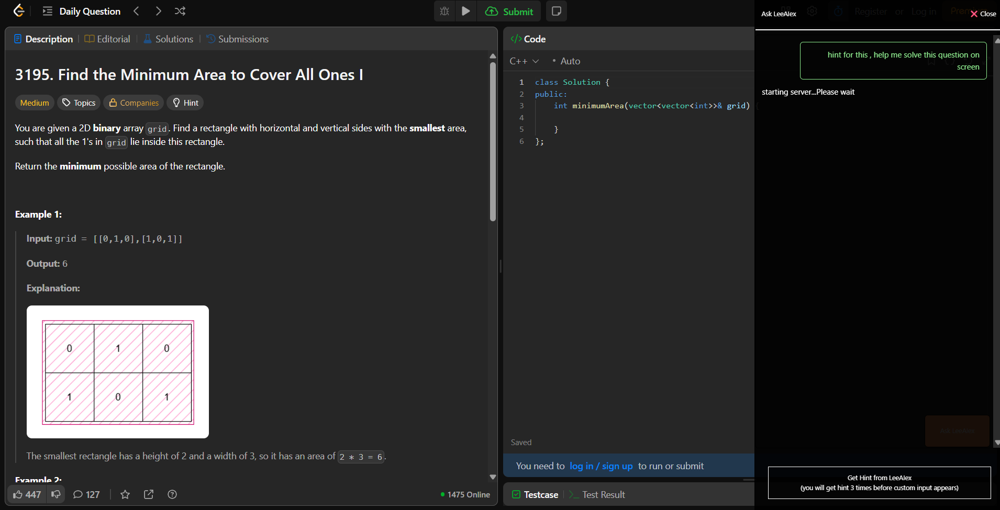
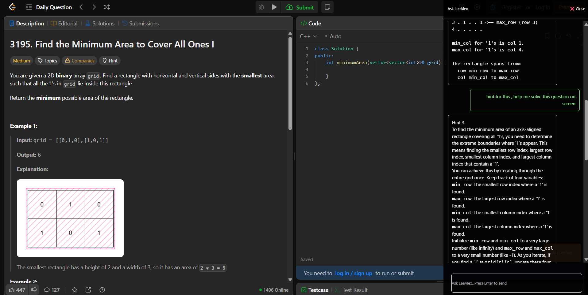

# LeeAIEx

LeeAIEx is a Chrome extension (Manifest V3) that adds an AI assistant to LeetCode problem pages.  
It follows a hint-first flow: users receive up to 3 progressive hints before custom free-text chat is unlocked.

## Features

- Works on `https://leetcode.com/problems/*`
- Floating `Ask LeeAIEx` button injected into problem pages
- Hint gate (`hint1` to `hint3`) before free-form questions
- Bring-your-own-key support using `chrome.storage.local`
- Node.js backend proxy for Gemini requests

## How It Works

1. User saves a Gemini API key in the extension popup.
2. On LeetCode problem pages, the content script injects a chat UI.
3. The content script calls the backend endpoint with:
   - prompt text
   - current page URL
   - API key in `geminiApiKey` request header
4. Backend forwards request to Gemini (`gemini-2.5-flash`) and returns generated text.

## Screenshots






## Project Structure

```text
leeaiex/
|-- public/
|   |-- manifest.json
|   |-- popup.html
|   |-- popup.css
|   |-- script.js
|   |-- button.js
|   `-- background.js
|-- backend/
|   |-- index.js
|   `-- package.json
|-- screenshot1.png
|-- screenshot2.png
|-- screenshot3.png
|-- screenshot4.png
`-- README.md
```

## Local Setup

### 1) Start Backend

```bash
cd backend
npm install
```

Create a `.env` file in `backend/`:

```env
PORT=3000
GEMINI_API_KEY=your_gemini_api_key
```

Run server:

```bash
npm start
```

Backend health check: `GET /`  
Main AI endpoint: `POST /backend`

### 2) Load Extension in Chrome

1. Open `chrome://extensions`
2. Enable **Developer mode**
3. Click **Load unpacked**
4. Select the `public/` folder

### 3) Configure API Key

1. Click the extension icon
2. Paste Gemini API key
3. Click **Save API Key**

Note: The current popup verifies the key against `https://leeaiex.onrender.com/backend`.

## Configuration Notes

- If you want to use your own local backend URL, update fetch URLs in:
  - `public/script.js`
  - `public/button.js`
- The extension currently sends requests as `text/plain` from the chat flow.

## Permissions Used

- `activeTab`
- `scripting`
- `storage`

## Current Limitations

- Chat rendering uses `innerHTML` for backend responses, so HTML returned by the model is injected directly.
- Endpoint URLs are hardcoded in frontend scripts.
- No automated tests are included yet.

## License

No license file is currently present in this repository. Add a `LICENSE` file if you want to define usage terms.
